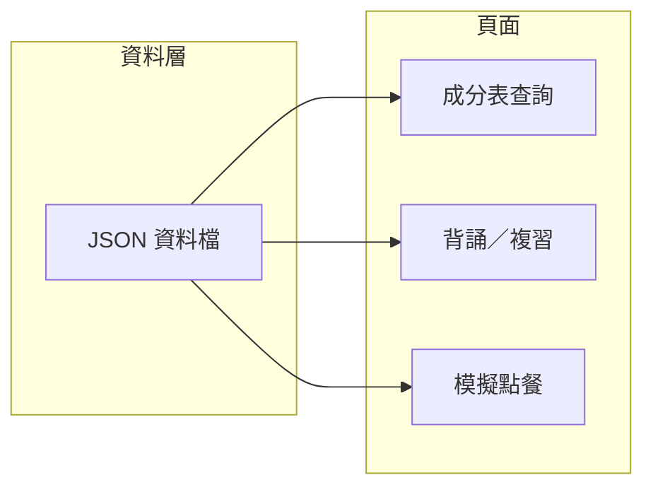

# 飲料成分表網頁版與模擬點餐規劃

## 一、資料與需求整理

**PDF 成分表**（約 14 頁）內容包含：

- **大類**：純粹茶 2.0、鮮果氣泡飲、古早味柴燒、陳飲特調、歐蕾就是鮮奶、果然好滋味、季節限定、極上限定等。
- **每品項**：茶量／原汁／牛奶量、糖量對照表（1 分糖～黃金比例）、冰塊量（正常／少冰／微冰／去冰／完去）、冰的步驟／溫熱步驟、加料版比例與步驟、備註（＃開頭）。
- **規則複雜**：去冰升一階糖、加料糖量 -5、部分品項紅糖/白糖、特例（如布丁單顆、芋頭 2 球）等。

**顧客菜單**（你提供的圖片）提供：

- 品項名稱、售價、大類副標。
- 圖示：人氣推薦、季節限定、可熱飲、甜度固定、冰量固定、無咖啡因。
- 加料選項：+10（奇芽籽、椰果、珍珠）、+15（小芋圓、寒天、布丁）。
- 甜度／冰量選項說明。

兩者需對齊：同一飲料在「成分表」用於背誦與出杯，在「菜單」用於點餐與價格；網頁需共用同一套品項與分類。

---

## 二、建議系統架構

- **單一資料源**：把 PDF 與菜單整理成 **JSON**（或之後可換成後端 DB）。一份資料同時給「成分表」、「複習」、「模擬點餐」用。
- **純前端先做**：不需後端即可上線，部署成靜態站或內部一臺機器開 index.html 即可，方便新員工用瀏覽器學習。

---

## 三、資料結構建議

建議用「大類 → 品項 → 該品項的配方與規則」分層，並與菜單對齊：

- **Category**（大類）：id、名稱、副標題、該類共通備註（例如「加購加料量到 150ml」）。
- **Item**（品項）：id、名稱、所屬 categoryId、**菜單用**：售價、圖示（推薦/季節/熱/甜度固定/冰量固定/無咖啡因）、可否加料。
- **Recipe**（配方，每個品項一組或依冰/熱/加料再細分）：
    - 糖量對照：甜度代碼 → 數值（或文字如「紅糖 10」）。
    - 冰塊量：冰量代碼 → 描述（如「16-18 顆」）。
    - 茶量／原汁／牛奶等：可依「正少微去」或「冰/熱」給不同值。
    - **步驟**：冰的步驟、溫熱步驟、加料版步驟（陣列字串）。
    - **備註**：＃ 開頭的那些規則（可陣列）。
- **Toppings**（加料）：名稱、加價、對配方影響（例如「加料糖量 -5」）— 與菜單一致。

PDF 裡同一大類下多品項共用同一張表（例如純茶 2.0 多款共一套糖量與步驟），可在 JSON 用「模板 + 品項覆寫」：一個 category 或 recipeTemplate 存共用，各 item 只存差異（若有）。

---

## 四、功能模組規劃

### 1. 成分表查詢（背誦用）

- **動線**：首頁或導覽 → 選大類 → 列出該類品項 → 點品項 → 顯示該杯的完整成分與步驟。
- **呈現**：
    - 依「甜度 × 冰量」表格顯示糖量、冰塊量、茶量等（與 PDF 對齊）。
    - 冰的步驟／溫熱步驟分開區塊；若有加料版，可 Tab 或摺疊切換。
    - 備註集中顯示在該品項下方。
- **可選**：網址帶品項 id（如 `#item=xxx`），方便書籤或主管發連結給新人練某一杯。

### 2. 背誦／複習

- **閃卡模式**：正面顯示品項名稱（＋可選：甜度/冰量），背面顯示糖量、關鍵茶量、步驟摘要；可依大類篩選。
- **或「遮罩複習」**：同一成分表頁，預設把數字/步驟遮住，點擊才顯示，讓員工先回想再對答案。
- **複習範圍**：可勾選大類或「人氣推薦」等，只出這些品項，避免一次量太大。

### 3. 模擬點餐

- **流程**：選飲料（同菜單分類與品項）→ 選甜度、冰量、是否加料（與菜單一致）→ 送出。
- **兩種用途可二選一或並存**：
    - **練習模式**：選完後直接顯示「正確配方與步驟」（從同一份 JSON 撈），讓員工對照自己是否會做。
    - **測驗模式**：選完後先讓員工自己說/寫配方或關鍵數字，再按「看答案」顯示正確內容，方便考核或自測。

模擬點餐的選項（甜度/冰量/加料）需與菜單與 PDF 規則一致（例如甜度固定品項不顯示甜度選項、冰量固定不顯示冰量選項）。

---

## 五、技術建議（簡要）

- **技術棧**：React 或 Vue 單頁應用（SPA），或若希望零建置則用純 HTML + CSS + JS 多頁；資料用 JSON 檔，`fetch` 載入。
- **資料產出**：PDF 需人工（或半人工）整理成 JSON；可先做 1～2 個大類、約 5～10 個品項做 MVP，確認結構後再補齊。
- **版型**：桌面優先，若有需要再做簡單 RWD，方便在店內平板或電腦使用。

---

## 六、實作順序建議

1. **定案 JSON 結構**：先以「純粹茶 2.0」+「古早味柴燒」為例，各做約 3～5 個品項，包含糖量、冰塊、步驟、備註，並對齊菜單上的名稱與售價。
2. **成分表查詢頁**：大類 → 品項 → 詳細比例與步驟頁；確認與 PDF 對照無誤。
3. **模擬點餐**：選飲料與選項 → 顯示正確配方（練習模式）；必要時再加「測驗模式」。
4. **背誦／複習**：閃卡或遮罩複習，依大類或標籤篩選。
5. **補齊其餘大類與品項**，並微調版面與說明文字。

---

## 七、注意事項

- **資料正確性**：JSON 需與 PDF 和店內實際 SOP 一致，建議由店長或資深員工校對。
- **規則邏輯**：如「去冰升一階糖」「加料 -5」等，若要在模擬點餐裡自動算糖量，需在資料或程式裡明確寫成規則，避免硬編碼在每個品項。
- **菜單與成分表對應**：同一飲料在菜單名稱可能與 PDF 略不同（例如「真．蕎麥輕綠茶」），需在 Item 裡做統一命名或別名，避免查不到。

若你願意，下一步可以從「JSON 結構範例（含 1 個大類、2～3 個品項）」或「成分表查詢頁的畫面線框」開始細化，我可以依你偏好的技術棧寫出更具體的欄位與畫面流程。
